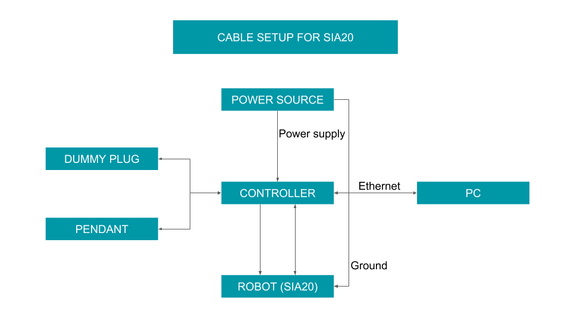

# ケーブルセットアップ

sia20,コントローラ，あなたのPC,ダミープラグ，ペンダントを下記の図のように接続してください．
Ethernetケーブルは自分の物を用意しましょう．
ダミープラグは附属品の袋の中に入っているDsub端子のことです．
電源とコントローラをつなぐケーブルと電源のグラウンドとロボットのグラウンドをつなぐ
ケーブルは自作する必要があります．

初めてSIA20を使う場合は下記の表のものを購入してください．

| 品名|個数|説明|
|-----|----|----|
|O端子|5   |電源にケーブルを接続する際に必要なものです．あなたが使用する電源がO端子では無い場合は，合う端子を購入してね|
|4心の電源ケーブル|1|ホームセンターとかで売ってます.電源とコントローラをつなぎます|
|1心の電源ケーブル|1|ホームセンターとかで売ってます．電源のグラウンドとロボットのグラウンドをつなぎます|
|Ethernetケーブル|1|ケーズとかで売ってます．というか研究室に転がってるのをパクりましょう|
|ハンダづけ一式|1|ケーブルを自作するときにいります|
