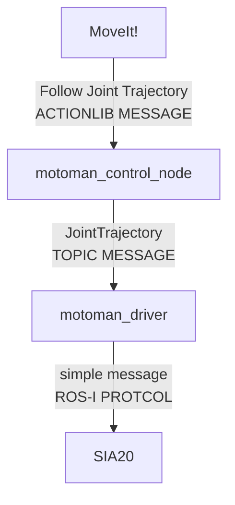

# Cartesian Velocity Control

直交座標系での手先の速度コントロールのためのパッケージ作成プロジェクト

!!! quote
	- [rqt_joint_trajectory_controller](https://github.com/ros-controls/ros_controllers/tree/melodic-devel/rqt_joint_trajectory_controller)
	- [motoman_control_node](https://github.com/Nishida-Lab/motoman_project/blob/indigo-devel/motoman_control/src/motoman_control_node.cpp)
	

## SIA20の制御メッセージの流れ

`rqt_joint_trajectory_controller`というrqtのプラグインを入れることによって
`JointTrajectory`のトピック(各関節ごとの値)をrqtから送ることができる．
これと同様のプログラムをC++で作成することから始め用と思う．

このプログラムは`sia20_control`に入れておこうと思う．

