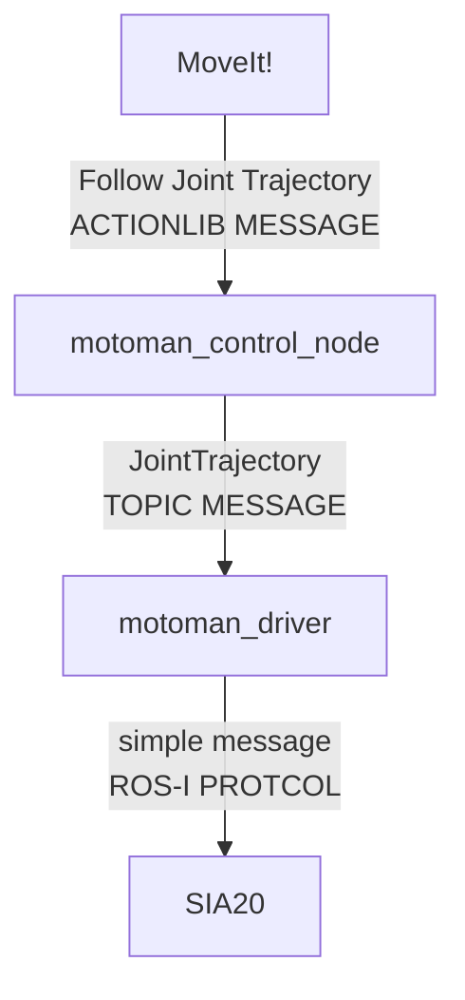
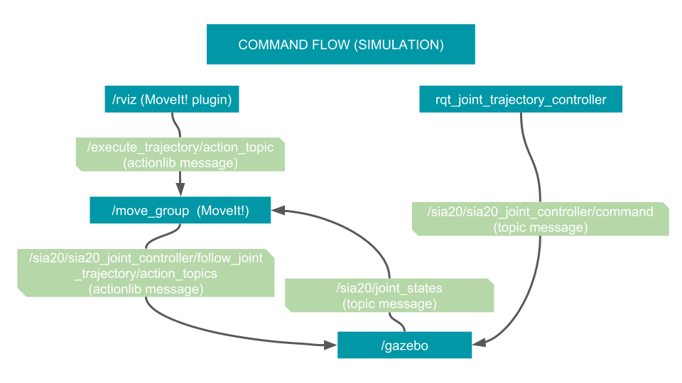
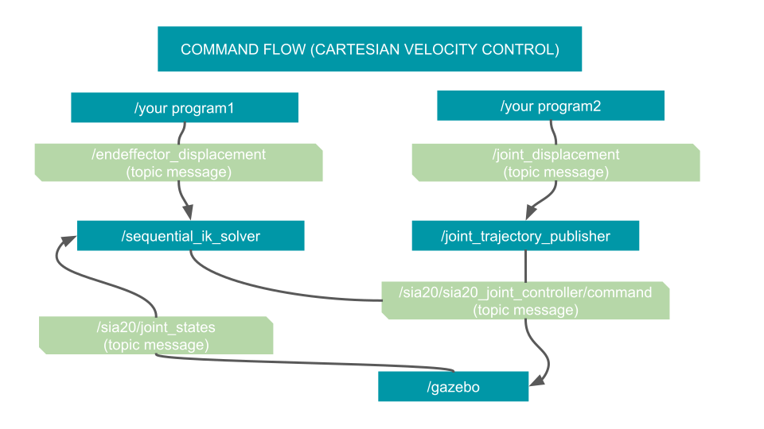

# Cartesian Velocity Control

直交座標系での手先の速度コントロールのためのパッケージ作成プロジェクト

!!! quote
	- [rqt_joint_trajectory_controller](https://github.com/ros-controls/ros_controllers/tree/melodic-devel/rqt_joint_trajectory_controller)
	- [motoman_control_node](https://github.com/Nishida-Lab/motoman_project/blob/indigo-devel/motoman_control/src/motoman_control_node.cpp)
	- [jog_arm](https://github.com/UTNuclearRoboticsPublic/jog_arm)
	- [moveit experimental](https://github.com/ros-planning/moveit/tree/master/moveit_experimental/jog_arm)
	

## SIA20の制御メッセージの流れ

### 実機



### シミュレータ



### /sia20/sia20_joint_controller/commandの中身

メッセージタイプは`trajectory_msgs/JointTrajectory`

```
header: 
  seq: 10473
  stamp: 
    secs: 0
    nsecs:         0
  frame_id: ''
joint_names: [joint_b, joint_e, joint_l, joint_r, joint_s, joint_t, joint_u]
points: 
  - 
    positions: [-0.998296, 0.77142, -0.85, -2.56, -3.06, -2.73, -1.84]
    velocities: []
    accelerations: []
    effort: []
    time_from_start: 
      secs: 1
      nsecs:         0
```

`rqt_joint_trajectory_controller`というrqtのプラグインを入れることによって
`JointTrajectory`のトピック(各関節ごとの値)をrqtから送ることができる．
これと同様のプログラムをC++で作成することから始め用と思う．

このプログラムは`sia20_control`に入れておこうと思う．


## sequential_ik_solverとjoint__trajectory_publisherの設計



### sequential_ik_solver

現在の手先位置からの差分を入力とし，逐次的にIKを解き，次の時刻で目指すべき
各関節の値( `JointTrajectory` トピック)を出力するノードの設計．

#### アルゴリズム

1. rosパラメータサーバから下記の要素を見つける
	- コントローラ名
	- JointTrajectoryのトピック名

1. 6要素(x,y,z,r,p,w)を持つ配列を受け取る
2. MoveIt!でIKを解く
3. JointTrajectoryトピックにしてパブリッシュ

### joint_trajectory_publisher

現在の角度からの差分を入力とし，それを`JointTrajectory`トピックに変換し出力するノードの設計．

#### アルゴリズム

1. rosパラメータサーバから下記の要素を見つける
	- コントローラ名
	- JointTrajectoryのトピック名

1. 7要素(s,l,e,u,r,b,tの変位)を持つ配列を受け取る
3. JointTrajectoryトピックにしてパブリッシュ
