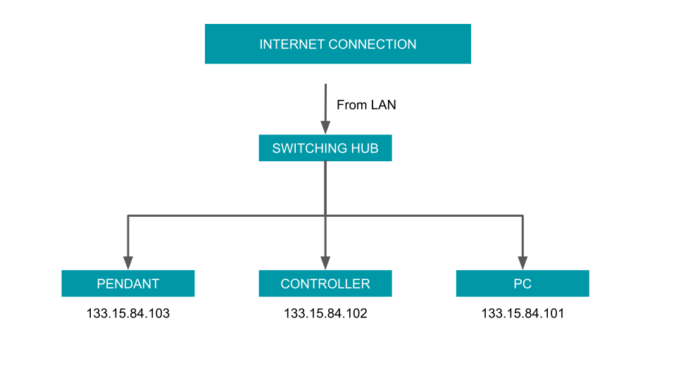

# インターネット接続

ROSを利用してSIA20を利用する場合は下記のようにネットに接続すると
快適に利用することができます．
図に書いてあるIPアドレスは例として書いたものです，あなたのネット環境に
合わせて適切に設定してください．

ティーチングペンダントにもIPアドレスを振る必要があることに注意してください．
また，この図ではPCが１台しか表示されていませんが，複数のPCを利用することも
可能です．また，Wifiも利用することが可能です．

