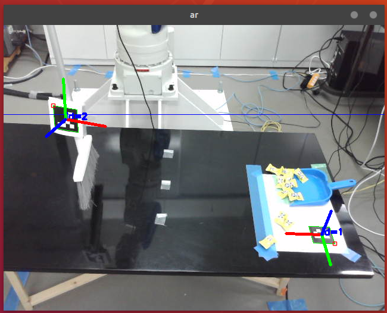
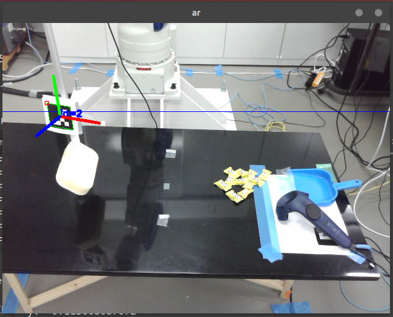

# 学習データ集め

## 立ち上げ方

### PC-NGで行うコマンド
roscore

```
roscore 
```

HTC Vive

```shell
roslaunch vive_ros server_vr.launch
rosrun vive_ros vive_node
```

motoman

```
roslaunch motoman_sia20d_moveit_config moveit_planning_execution.launch sim:=false controller:=fs100 robot_ip:=10.0.0.2
```

pose_follower

```
rosrun manipulator_pose_following pose_following_jaco_node
```

pose_follow_planner

```
rosrun sia20_control pose_follow_planner3
```
*pose_follow_planner*ではなく,必ず3の方を選ぶこと
これを間違えるとコントローラと手先の座標が合わない

logger
```
rosrun sia20_control log_teacher_data
```
立ち上げ後，Viveコントローラの側面のボタンを押すとロギングを開始し，
再度，押すとロギングを終了する．なおボタンを押すごとにロギングファイルが作成される．

初期位置への移動
```
rosrun sia20_control move_init_pose_srv_node
```
立ち上げ後，ロボットは初期位置へ戻る

ar image
```
rosrun sia20_recognition ar_pose_estimation
```
ar image and sand 
```
rosrun sia20_recogition ar_marker_and_candy_pose_estimation_node 
```

圧力センサ
```
sudo chmod 777 /dev/ttyACM0
rosrun sia20_recogition leptorino 
```

追従を始める前にロボットの手先方向（ｚ軸）とコントローラの尻尾（ｚ軸）の方向を合わせてからViveのコントローラの丸ボタン押すと直感的に制御しやすい．

## 初期条件
### Long normal broom
#### ar markerの取り付け角度




- linear
	- x : -0.33 ~ -0.31
	- y : -0.11 ~ -0.10
	- z : 0.10  ~ 0.12
- anguler
	- x : -2.59
	- y : -0.21 ~ -0.27
	- z : 0.10 ~ 0.12

### Long sponge broom
### ar markerの取り付け角度
- linear
	- x : -0.32
	- y : -0.11
	- z : 0.22
- angular
	- x : -2.5
	- y : -0.16
	- z : 0.22




## Issue

### テレオペを始めたときにrollが１８０度だけ移動する．
	初期値を変更するのではなく，開始時（丸ボタンを押したとき）にrollが１８０度
	必ず回転することを利用し，180度移動した後に，もう一回ボタンを押すことで回転をキャンセル
	することができる．バッドノウハウ．
